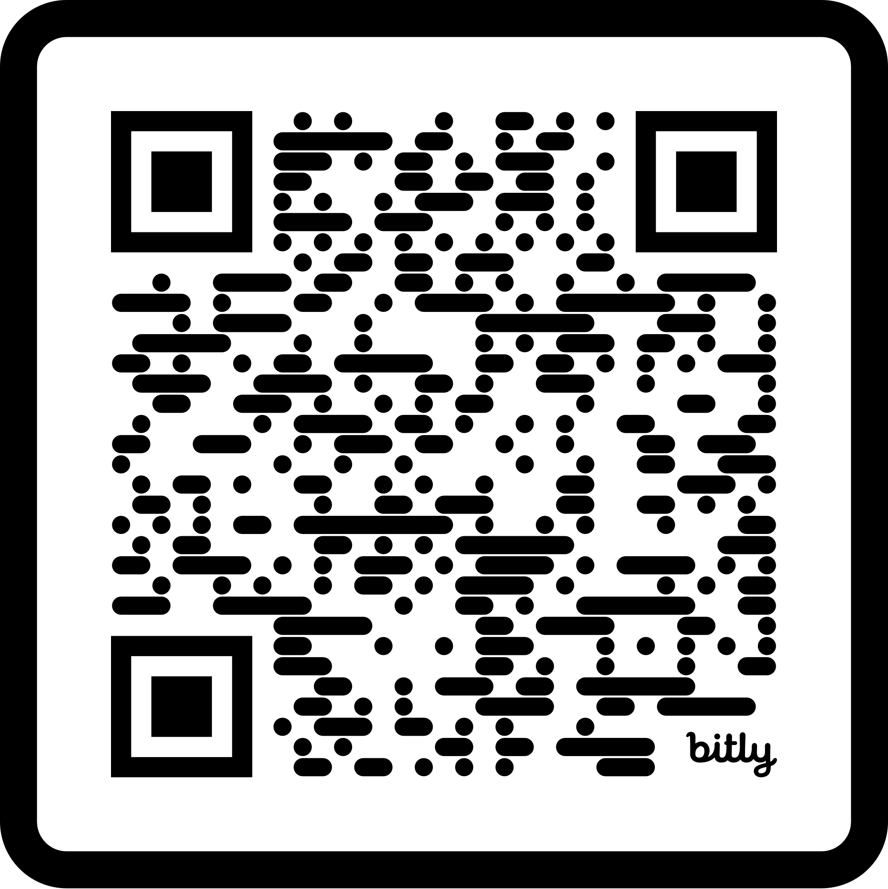

# Iman Hedeshy :man_technologist:

Hi there! I'm Iman Hedeshy, a Software Engineer with a strong foundation in electrical engineering, project management, and leading cross-functional teams. I'm skilled in a wide range of technologies including HTML, CSS, JavaScript, React, Node.js, and many more. I'm committed to driving innovation and achieving exceptional outcomes in the tech industry.

## :page_facing_up: Resume

For a detailed look at my education, skills, and work experience, feel free to check out my [resume](iman-hedeshy-resume.pdf).

## :hammer_and_wrench: Technologies and Tools

- **Languages:** JavaScript (OOP, ES6+), TypeScript, Python
- **Frontend:** React, HTML5, CSS3, SASS, Redux, MaterialUI (MUI), Bootstrap, Tailwind CSS
- **Backend:** Node.js, Express.js, Flask
- **Database:** MySQL, MongoDB
- **Cloud & Hosting:** Heroku, Netlify, AWS
- **Testing:** React Testing
- **Version Control:** Git, GitHub, Git Flow, Pull Requests, Code Reviews
- **API Design & Testing:** RESTful APIs, Postman, API Documentation and Blueprint
- **Design & Prototyping:** Figma, Sketch
- **Package Managers:** NPM, yarn, pip, brew
- **Libraries & Frameworks:** Axios, Socket.io, Passport.js, Lodash, React Router, Knex.js, Mongoose
- **Desktop Application Frameworks:** Electron
- **Programming Paradigms:** Strong understanding of Object-Oriented Programming (OOP) concepts and their application in software development.
- **Others:** Agile Methodologies, Scrum Practices, Security and Privacy Strategies, Microservices Architecture; comfortable with various command-line interfaces (Zsh, Bash, PowerShell, CMD, Windows Terminal); understanding of API Design Principles and Performance Optimization; familiar with the concept of CDNs for optimized content delivery; aware of web accessibility standards (WCAG) and the importance of creating responsive, device-agnostic interfaces; knowledge of Internationalization and Localization for adapting applications globally.

  
   
   
  
  
  
   
  
   
   
  
  
  
  
  
  
  
  
  
  
  
  
  
  
  
  
  
  
  
  
  
  
  
  
  
  
  
  

## :seedling: Recent Projects

- [**TheBOX! (Bridge Of eXperience)**](https://github.com/imanhedeshy/the-box-client.git) - Full-stack social networking/educational app enhancing collaborative engagement.
-  [**PrivacyVault**](https://github.com/imanhedeshy/triton-secutiry-solution.git) - Privacy app safeguarding user data, crafted in a 24-hour hackathon challenged by Microsoft. (Which our Team was the WINNER! 🏆)

- [**SolarSystem**](https://github.com/imanhedeshy/solar-system.git) - Interactive simulation of the solar system, exploring celestial bodies.

... and more in my [projects tab](https://github.com/imanhedeshy?tab=repositories).

<!-- ## :chart_with_upwards_trend: GitHub Stats -->

## :octocat: GitHub Statistics

  
| Total Stars Earned | Total Forks | Total Issues | Total PRs | Total Contributions |
|--------------------|-------------|--------------|-----------|----------------------|
| <!--totalStars-->4<!--/totalStars--> | <!--totalForks-->0<!--/totalForks--> | <!--totalIssues-->0<!--/totalIssues--> | <!--totalPRs-->1<!--/totalPRs--> | <!--totalContributions-->511<!--/totalContributions--> |

Feel free to explore my repositories and don't hesitate to contribute or give feedback!

## :mailbox: Contact Me

- Email: [iman@hedeshy.ca](mailto:iman@hedeshy.ca)
- Skype: iman.hedeshy
- Phone: [+1 416 939 4969](tel:+14169394969)
- Slack: Use email [iman.hedeshy@gmail.com](mailto:iman.hedeshy@gmail.com)
- BrainStation Graduate Page: [Software Engineering Graduates](https://brainstation.io/hiring-brainstation-graduates)

Feel free to reach out on [LinkedIn](https://www.linkedin.com/in/imanhedeshy/) if you wish to get in touch or collaborate on a project. Happy coding!
 

